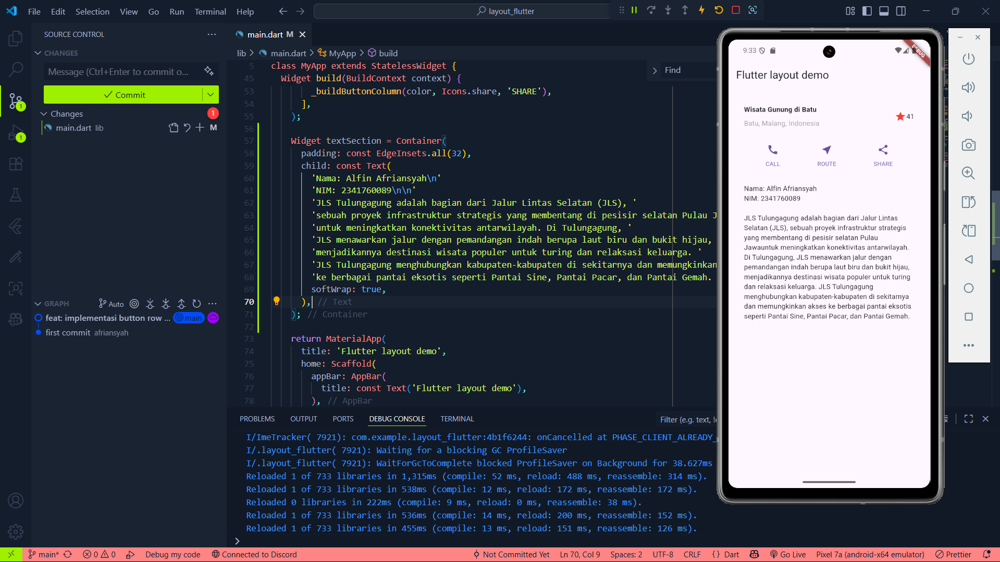

# 📱 Praktikum Flutter — Layout dan Navigasi  

**Mata Kuliah:** Pemrograman Mobile  
**Dosen Pengampu:** Ade Ismail, S.Kom., M.TI  
**Nama:** Alfin Afriansyah  
**NIM:** 2341760089  
**Kelas:** SIB 3C  

---

## 📌 Praktikum 1: Membangun Layout di Flutter
- Membuat project `layout_flutter` dengan **VS Code**.  
- Implementasi title row.  

📷 **Screenshot:**  

---

## 📌 Praktikum 2: Implementasi button row
- Menambahkan button row ke aplikasi flutter.  

📷 **Screenshot:**  

---

## 📌 Praktikum 3: Implementasi text section
- Membuat widget textSection.  

📷 **Screenshot:**  

---

## 📌 Praktikum 4: Implementasi image section
- Menambahkan image section.  

📷 **Screenshot:**  
  